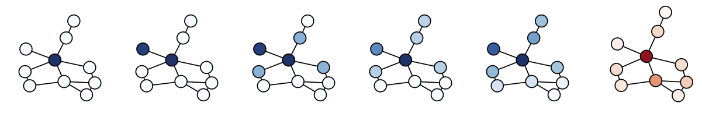

# PushNet


PyTorch-implementation of the *PushNet* models proposed in the paper:

[PushNet: Efficient and Adaptive Neural Message Passing](https://arxiv.org/pdf/2003.02228.pdf)  
Julian Busch, Jiaxing Pi and Thomas Seidl  
European Conference on Artificial Intelligence (ECAI) 2020

## Setup

- Install the required packages specified in the file `requirements.txt`, e.g., using the command `pip install -r requirements.txt`.
- Additionally, PyTorch version 1.6.0 is required and can be installed depending on your system and CUDA version following this guide: [https://pytorch.org/get-started/locally/](https://pytorch.org/get-started/locally/).
- Our models are implemented using PyTorch Geometric and require the following packages which can be installed depending on your system and CUDA version following this guide: [https://pytorch-geometric.readthedocs.io/en/latest/notes/installation.html](https://pytorch-geometric.readthedocs.io/en/latest/notes/installation.html).
    ```
    torch_scatter==2.0.5
    torch_sparse==0.6.7
    torch_cluster==1.5.7
    torch_spline_conv==1.2.0
    torch_geometric==1.6.1
    ``` 
  
## Demo
We provide a demonstration of how to train our models from loading and pre-processing data to evaluating the trained model. Please check out the notebook `src/demo.ipynb`.

## Running Experiments
- To run experiments or to reproduce the results reported in the paper, you can use the script `src/run_experiment.py`.
- For efficiency, the script loads previously pre-processed datasets. Datasets can be pre-processed using the script `src/preprocess_datasets.py`.
- Parameters need to be specified in a config-file in *JSON*-syntax. We uploaded the config-files used in our experiments into the folder `config`.
- The provided configs allow for training on 12GB GPUs. We ran our experiments on an NVIDIA GeForce RTX 2080 Ti GPU with 12GB memory. If you have more memory available, you can increase or disable the parameter `batch_size_messages` for faster training with identical results or decrease the hyper-parameter `epsilon`. If you have less GPU memory available, you can decrease `batch_size_messages` or increase `epsilon`.
- Results will be tracked by *MLflow*. We uploaded the results from our runs which can be explored using the notebook `src/evaluate_results.ipynb`.
- *Note: This is a re-implementation of the original code used to produce the results reported in the paper. Due to a different environment, different random seed, etc., the results reported here slightly differ from the results reported in the paper.*

## Cite
If you use our models or any of the provided code or material, please cite our paper:

```
@inproceedings{busch2020pushnet,
  title={PushNet: Efficient and Adaptive Neural Message Passing},
  author={Busch, Julian and Pi, Jiaxing and Seidl, Thomas},
  booktitle={24th European Conference on Artificial Intelligence (ECAI)},
  year={2020}
}
```
